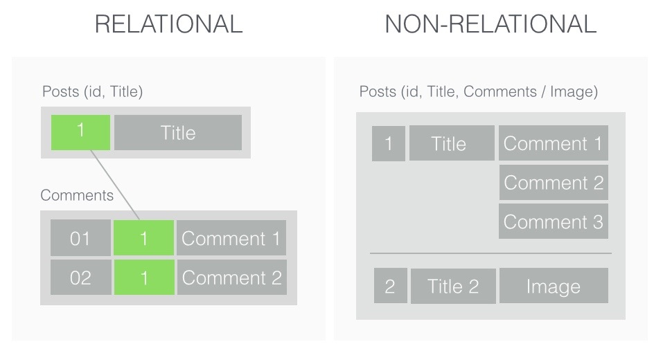

# MongoDB

**Author**: [@FarahZaqout](https://github.com/FarahZaqout)

**Maintainer**: [@aaamra](https://github.com/aaamra), [@LinaYahya](https://github.com/LinaYahya) 

## Table of Contents
- [What is MongoDB](#What-is-MongoDB)
- [Why Learn MongoDB](#why-learn-mongodb)
- [Installing MongoDB](#installing-mongodb)
- [Using the Mongo Shell | Mongosh](#using-the-mongo-shell)
    - [Creating a database](#creating-a-database)
    - [MongoDB Collections](#mongodb-collections)
- [Documents](#documents)
    - [Updating Documents](#updating-documents)
    - [Deleting many documents](#deleting-many-documents)
- [Mongoose](#mongoose)   
  - [MongoDB with Mongoose](#mongodb-with-mongoose)
  - [Setup](#setup)
  - [Mongoose Schema and Models](#mongoose-schema-and-models)
  - [Joins](#joins)
  - [Time to practice](#final-task)

## What is MongoDB
You are probably familiar with the term MEAN stack or MERN stack. Which stands for MongoDB, Express, Anguar/React and Nodejs.

MongoDB is one of the most popular non-relational (NoSQL) database managment systems, a schema-less. It means you can store JSON documents in it, and the structure of these documents can vary as it is not enforced like SQL databases.




## Why Learn MongoDB
MongoDB is a very useful technology to learn. While its use cases can be debated quite a lot on stack overflow threads, one thing remains solid. There's a lot of demand for it, and a lot of technologies work very well with it. So technicalities aside, for a junior web developer, MongoDB is a solid bet to improve employability, and for now that's all that really matters, because works is also the fastest way to improve our coding and problem solving skills.


## Installing MongoDB:
MongoDB docs are very clear and concise. Follow [this section](https://www.mongodb.com/try/download/community?tck=docs_server) of the docs to install mongoDB on Ubuntu or Windows.

I prefare to install [MongoDB Compass](https://www.mongodb.com/try/download/compass) also. if you install the complete edition of mongo it will come with it

or if you dont want to install it localy you can use the cloud service of mongodb its called [MongoDB Atlas database service](https://www.mongodb.com/atlas/database)

Once the installation is complete, follow the same section to start the mongo server in your terminal.


## Using the Mongo Shell:
Once the mongo instance is started, all you need to access its shell is to type `mongo` in your terminal. The shell is a javascript interface to query your database. It allows you to execute all queries supported by mongodb directly from the terminal, with javascript syntax.


### Creating a database:
In mongoDB, creating a new database from the mongo shell is a simple two words command.`use dbName`. So let's create a `mongo-test` database.

What this command does is check if the database exists, if it does, it switches to it, if not, it creates it then switches to it.

* `use mongo-test`
* the terminal should output the following message `switched to db mongo-test`

From there, we can start playing around with the shell and see how easy and quick it is to set up a mongodb database.

### MongoDB Collections:
A collection in MongoDB is like a table in SQL database. However, the fundamental difference is that in MongoDB we don't have a schema. Which means, we don't need to define how the collection looks like before creating it.

In fact, we don't need to create the collection to use it. If a collection does not exist, mongoDB will create it for us. I will explain this in the next section.

#### Creating a collection:
Let's say we want to create a `users` collection (like a users table). All we need to do is to insert a user.

* Make sure we are on the mongo-test database by writing `db` in the mongo shell. This command will tell you which database you are using right now.
* To create a users collection, we simply insert a new user. `db.users.insertOne({ name: 'Farah'})`
* the result of this query should be similar to this:
```javascript
{
	"acknowledged" : true,
	"insertedId" : ObjectId("5ea6aeaa93dd6c5d89e44ba3")
}
```

Now to make sure we actually created the collection `users`, write the following query in the shell:
* `db.users.find()`
This query is similar to `SELECT * FROM users` in SQL.

Notice the result has an `id`. In MongoDB, id is automatically added.

## Documents:
A table in SQL has rows. In MongoDB, a collection has documents. So, when we inserted a user into the users collection, that user is a document now.

### Updating Documents:

So we know how to create documents and collections. But a users with only `name` is not very useful for us. Instead of rewriting the whole database schema and losing all data, we can simply update the document, and the collection will change to match it.

Let's add an `age` key to the users collection/documents.

* Let's check how the users collection looks like again `db.users.find()`
* Now let's update the `farah` user:
* `db.users.updateOne({name: 'farah'}, {$set: {age: '28'}})`

The `updateOne` Method takes two arguments and an optional third. For now, we will only look at the two required ones.
* First argument is the filter. It tells MongoDB how to find the document we want to update. The second argument is the change we want to apply.


* Task: 
    * Create a new user document.
    * Give it a name and an age.
    * Update it as follows (in one update command):
        * change the name and age
        * add a last name, an email, and a city.
        * use the command `db.users.find()` to see how the collection can accomodate different document objects.

Notice how the old document did not change, but the new one has a last name, an email, and a city. This is one of the biggest features of No-SQL database models. It can be very flexible, which means it scales incredibly well.

### Deleting a document:
To delete a document use the command `db.[collectionName].deleteOne( filter )`

In our case, let's delete the `farah` document.
* `db.users.deleteOne( { name: "Farah" } )`
* `db.users.find()` >> Should only output one user now.

### Deleting many documents:
In order to delete many documents, we use the command `db.collectionName.deleteMany()`. This command allows us to delete all of the documents in a collection, or to delete a set of documents based on a filter we give it. Let's try it out with an example from the docs.

* create an inventory collection and populate it with data.
```javascript
db.inventory.insertMany( [
   { item: "journal", qty: 25, size: { h: 14, w: 21, uom: "cm" }, status: "A" },
   { item: "notebook", qty: 50, size: { h: 8.5, w: 11, uom: "in" }, status: "P" },
   { item: "paper", qty: 100, size: { h: 8.5, w: 11, uom: "in" }, status: "D" },
   { item: "planner", qty: 75, size: { h: 22.85, w: 30, uom: "cm" }, status: "D" },
   { item: "postcard", qty: 45, size: { h: 10, w: 15.25, uom: "cm" }, status: "A" },
] );
```

* It should output the following object: 
```javascript
{
	"acknowledged" : true,
	"insertedIds" : [
		ObjectId("5ea6cd2393dd6c5d89e44ba5"),
		ObjectId("5ea6cd2393dd6c5d89e44ba6"),
		ObjectId("5ea6cd2393dd6c5d89e44ba7"),
		ObjectId("5ea6cd2393dd6c5d89e44ba8"),
		ObjectId("5ea6cd2393dd6c5d89e44ba9")
	]
}
```

This tells you that the command is successful, and returns the ids of objects inserted. Now let's delete them all!

* `db.inventory.deleteMany({})`

This command should output: `{ "acknowledged" : true, "deletedCount" : 5 }`. Which tells us that 5 items were deleted successfully.

But what if we want to delete one only. Or a few but not all. Let's populate the collection with a new set of data.

```javascript
db.inventory.insertMany( [
   { item: "journal", qty: 25, size: { h: 14, w: 21, uom: "cm" }, status: "A" },
   { item: "notebook", qty: 25, size: { h: 8.5, w: 11, uom: "in" }, status: "P" },
   { item: "paper", qty: 25, size: { h: 8.5, w: 11, uom: "in" }, status: "D" },
   { item: "planner", qty: 75, size: { h: 22.85, w: 30, uom: "cm" }, status: "D" },
   { item: "postcard", qty: 45, size: { h: 10, w: 15.25, uom: "cm" }, status: "A" },
] );
```

This set of data is similar to the first one, but the quantity of the first 3 items is the same (`25`). This will be our delete filter.

* Delete all items with a quantity of 25: `db.inventory.deleteMany({qty: 25})`
* The terminal should output the following: `{ "acknowledged" : true, "deletedCount" : 3 }`
* Check which items remain in the database: `db.inventory.find()`

Now the basic `CRUD` operations should be easy to implement in the shell.

Before we move on. Just like `deleteMany` can be used to delete all or delete based on a filter, `find` can also do the same. The difference between `find` and `findOne` is that `find` will return all results matching. So if we have two users named `Ahmad`, the query will return both. `findOne` will return the first document that matches the filter.

This is a pattern in MongoDB. That being said, it's very simple and easy to set up and use.

To play around further with MongoDB, [this](https://docs.mongodb.com/manual/crud/) Is the best starting point available.

---


## Mongoose
Let's face it, writing MongoDB validation, casting and business logic boilerplate is a drag. That's why we wrote Mongoose.
```javascript
const mongoose = require('mongoose');
mongoose.connect('mongodb://localhost:27017/test');

const Cat = mongoose.model('Cat', { name: String });

const kitty = new Cat({ name: 'Zildjian' });
kitty.save().then(() => console.log('meow'));
```
Mongoose is a object modeling for node.js provides a straight-forward, schema-based solution to model your application data. It includes built-in type casting, validation, query building, business logic hooks and more, out of the box.


## MongoDB with Mongoose:
MongoDB is easy to start with. It scales well, integrates very well with many web technologies and we don't need to worry about schema and evolving data. However, in real life projects, queries can get very big and ugly, still easy, but big and ugly.


So let's get started right away. Make a new directory `mongo-walkthrough` or whatever name you want and initialize it.

### Setup:
* `mkdir mongo-walkthrough`
* `cd mongo-walkthrough`
* `npm init -y`
* `npm i mongoose env2`
* `npm i -D jest` (oh yeah, you'll never escape testing.)
* `mkdir database database/models database/queries tests`
* `touch .env database/connection.js tests/index.js`

---

Now we have the basic project file structure and dependencies ready. Let's start coding.

First, let's make sure we are connected to the mongodb server. 
* Open a new terminal tab and type `mongo`.
* Create a new database `mongo-walkthrough`
* in our `.env` file add the connection link:
>`DB_URL=mongodb://localhost:27017/mongo-walkthrough`
* in `connection.js` let's set up our mongodb connection:
```javascript
require('env2')('.env');
const mongoose = require('mongoose');

const dbUrl = process.env.DB_URL;

mongoose
  .connect(dbUrl)
  .then(() => console.log('database connected successfully'))
  .catch((err) => console.log(err));

module.exports = mongoose.connection;
```

In the code above, we established the connection logic to our mongodb server. This is similar to the `pg` module logic.

We will be using this code to open a connection through which we can query the database and do our `CRUD` operations. We will run it once only, but before that, let's move on to define a schema.

### Mongoose Schema and Models:
A Mongoose model is a wrapper on the Mongoose schema. A Mongoose schema defines the structure of the document, default values, validators, etc., whereas a Mongoose model provides an interface to the database for creating, querying, updating, deleting records, etc.

In the models directory, create a `User.js` file.

```javascript
// User.js
const { Schema, model } = require('mongoose');

// Schema determines how the model looks like
const userSchema = new Schema({
	firstName: 'string',
	lastName: 'string',
	age: 'number',
	city: 'string',
});

// creating a model so we can query it.
const User = model('User', userSchema);

module.exports = User;
```

Now this is where the schema actually makes things easier for production apps. In MongoDB, we can add any new keys to a document in our users collection. 

Also, the same key can be many types. Without mongoose, `age` here can be number, a string or even an object. Needless to say this can lead to many bugs and we have to handle the validation manually. Mongoose automates this away for us.

Now that we have a model, let's write our first set of queries for that model.

in the `queries` directory, create a `users.js` file.

```javascript
// queries/users.js
const User = require('../models/User');

const createUser = ({ firstName, lastName, age, city }) => {
	return User.create({ firstName, lastName, age, city });
};

const findAll = () => User.find();

const findOne = (name) => User.findOne({ name });


const deleteAll = () => User.deleteMany({});


module.exports = {
  createUser,
  findAll,
  findOne,
  deleteAll
};


```

Now we are ready to test if our database is set up properly or not. Take a look at the `createUser` query. It requires a `user` object and returns a query. So let's test it.

In the `test` directory, create a file `users.test.js`

```javascript
// users.test.js
const connection = require('../database/connection');
const { createUser } = require('../database/queries/users');

test('test creating new user', () => {
  const user = {
    firstName: 'Farah',
    lastName: 'Zaqout',
    age: 28,
    city: 'Gaza',
  };
    
    // insert new user
  return createUser(user)
            .then(( res ) => {
                console.log(res);
                expect(res.firstName).toBe(user.firstName);
                expect(res.lastName).toBe(user.lastName);
              });
});

afterAll(() => connection.close());
```

Now let us change the test to see if the validation works. Change the first name to a number, for example `123`. You will notice that the query still passed and a document was created but without the `firstName` key. 

This means the validation passed, but that is not how we want it to behave. If data is invalid, we want to know that and we want our data to not go in.

The reason why invalid data was ignored is that the keys on a document are not `required` by default. Let's make the firstName required.

```javascript
//database/models/User.js
const userSchema = new Schema({
	firstName: { type: 'string', required: true },
	lastName: 'string',
	age: 'number',
	city: 'string',
});
```

This is how we define a required property. We can also make it a unique property as well, by adding a `unique` key.

Note: the `unique` validator in mongoose is not smart. If we already have duplicate values in our database, new values will not be checked. So make sure you know which values are unique in your schema before you start testing.

#### Good Practice: delete all entries in your database before running each test case to make it easier to predict outputs.

Add a unique property to the name field and update our test to create the same user twice.

```javascript
// users.test.js
const connection = require('../database/connection');
const { createUser, deleteAll } = require('../database/queries/users');

test('hello', () => {
  const user = {
		firstName: 'Farah',
		lastName: 'Zaqout',
		age: 28,
		city: 'Gaza',
	};
    

  expect.assertions(2);

    // insert new user
  return deleteAll()
          .then(() => createUser(user))
          .then(() => createUser(user))
          .catch((err) => {
            console.log(err);
            expect(err.name).toBe("MongoServerError");
            expect(err.code).toBe(11000);
          });
});

afterAll(() => connection.close());
```
This wil now throw an error.

#### Task:
Create and test a query to find all users by their first name. This time make comparisons. 
Hint: you can pass a `filter` object to the `find` method.

---

### Joins:
Since mongoose is a schema based tool, we can do something similar to `join` in SQL. It's called `populate`. To use it, we need to define our `ref` (foreign key) in the schema, then we can use the `populate` method in our queries.

Let's create a `Posts` schema.
```javascript
// models/Post.js
const { Schema, model } = require('mongoose');

const postSchema = new Schema({
	content: String,
	author: {
		type: Schema.Types.ObjectId,
		ref: 'User',
	},
});

const Post = model('Post', postSchema);

module.exports = Post;

```
In the code above, we are telling the Schema that it will have a `content` field, and an `author` field. We are telling the schema that author will be an `id` and that it will exist in the `Users` model. When we create a new post, this code checks if the id provided actually follows the mongoose pattern for id before creating the new post.

Now let's write the `posts` queries. In the `queries` directory, create a file `posts.js`

```javascript
// queries/posts.js
const Post = require('../models/Post');


const createPost = ({ content, author }) => {
	return Post.create({ content, author });
};

const findAllPosts = () => {
	return Post.find();
};

const deleteAllPosts = () => {
	return Post.deleteMany({});
};

module.exports = {
  createPost,
  findAllPosts,
  deleteAllPosts
};
```
Notice how the `createPost` query is no different from the `createUser`. The `author` here will be the id of a user. Lets test if this will work. Create a `posts.test.js` file.

```javascript
// posts.test.js
const connection = require('../database/connection');
const { deleteAllPosts, createPost } = require('../database/queries/posts');
const { createUser, deleteAll } = require('../database/queries/users');

test('hello', () => {
  const user = {
		firstName: 'Farah',
		lastName: 'Zaqout',
		age: 28,
		city: 'Gaza',
	};
    

    // insert new user
  return deleteAll()
          .then(() => deleteAllPosts())
          .then(() => createUser(user))
          .then((newUser) => createPost({
              content: 'Hello, G11',
              author: newUser._id
          }))
          .then((res) => {
            console.log(res);
            expect(res.content).toBe('Hello, G11');
            expect(res).toHaveProperty('author');
          });
});

afterAll(() => connection.close());

```

In order to create a post, we will need a user to exist in the database. We query the user we want, and then use the id in our `createPost` query.

If everything is working correctly, the result of line 24 will be something like:
```jsonld=
{
  _id: 5ea804621aed19d2a86aae23,
  content: 'Hello, G11',
  author: 5ea804621aed19d2a86aae22,
  __v: 0
}
```
---

## Final Task:
Yay! Now you are great mongodb developers. If you understand the workshop, you know more than I did after 2 months of using MongoDB. So good job!

Now, for our final challenge, we are going to build a simple blood bank API. It will not have any html or css. Just a nodejs server and mongodb.

### Requirements:
The data in our API will be:
* Patients: name, blood group.
* Donors: name, blood group, contact number, blood bank.
* Blood bank: name, city, contact number, list of donors.

endpoints available will be:
* `/donors` with get and post methods.
* `/patients` with get and post methods
* `/blood-banks` with get and post methods.

### Testing:
* Write at least 1 test for each endpoint. Preferably a test for each method.
